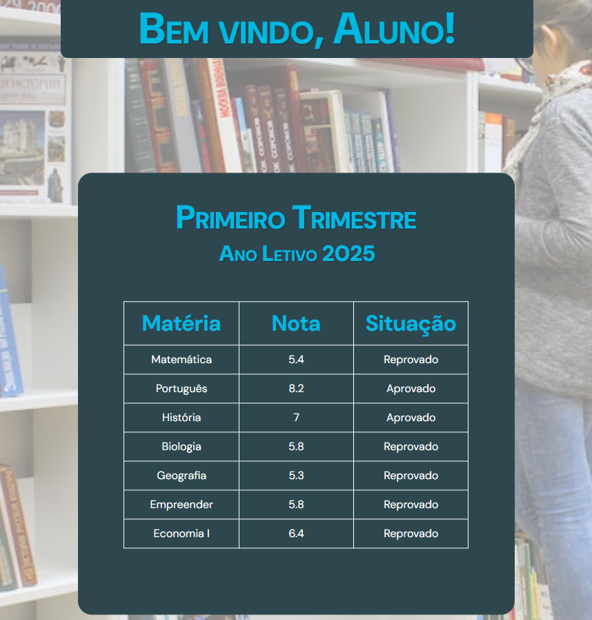

# Site para alunos do Colégio Bragantino (Fictício)
 

## Página de Login para o aluno:

## Página de Consulta para o aluno:

 

## Qual a ideia principal desse projeto?

##### A idéia era e foi abordar algus princípios básicos de uso e manipulação do JS. Esse de fato é o primeiro projeto onde consigo abordar algumas manipulações de elementos, uso de condicionais (if/else if) etc e a lógica de programação.
#### E para todo esse projeto fazer sentido, pense que o aluno já possui um cadastro, cujo o mesmo é feito diretamente pela Coordenadoria do Colégio, assim fica mais fácil de entender a lógica em que eu cheguei para montar todo esse projeto.
#### Como ainda não possuo conhecimento de banco de dados, criei de uma forma bem genérica, então para um futuro próximo quem sabe eu faço algo mais completo e atualizo esse projeto com uma lógica mais profunda.
#### O sistema de login, criei partindo do presuposto citado a cima, então já "cadastrei" com 2 variáveis e chamando em uma função.

## O que tem nesse código?
#### :sparkles: Condicional (IF/ELSE IF);
#### :sparkles: Recuperação de Senha e CIDE, ainda com exibição de um *Alerta* com sinal positivo;
#### :sparkles: Exibição de um *Alerta*, caso a Senha ou a CIDE esteja inválida;
#### :sparkles: Tabela de notas dos alunos (gerada de forma aleatória para dar dinamicidade e trabalhar outros "elementos" do JS);
#### :sparkles: Resultado Aprovado ou Reprovado dependendo da nota recebida;
#### :sparkles: A exibição de Primeiro/Segundo/Terceiro/Quarto *Trimestre* está automática, conforme o ano for passando ele atualiza sozinho;

#### :construction: Quem tiver o interesse de testar o projeto -> Login: 452918 - Pw: Escola21?
